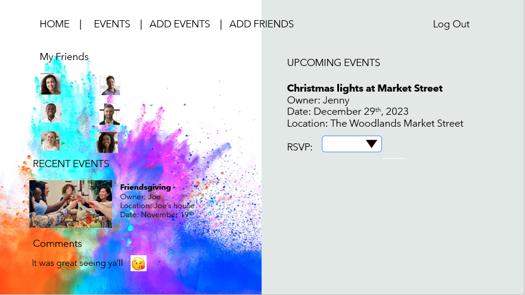

## Project 2 - Fun Events Tracker

This is a fun app that a group of friends can use as a platform to post fun events around town. The user can view the event, the location and the details. This app is meant to help a group of individuals to stay connected and keep the friendship going. 

## User Stories

For privacy reasons, the user should only have access to the group's information if logged in. As a user I should be able to do the following:
    "*" Log in 
    "*"Have a rendered view of all the fun events coming up
    "*"Have the capability of commenting on the the events and viewing all my friends comments in the posted event
    "*"Post a new event
    "*"Have the choice to confirm if I am going, if not going, or may be going
    "*" Log out

## Wireframes

## Entry Relationship Diagram (ERD)

