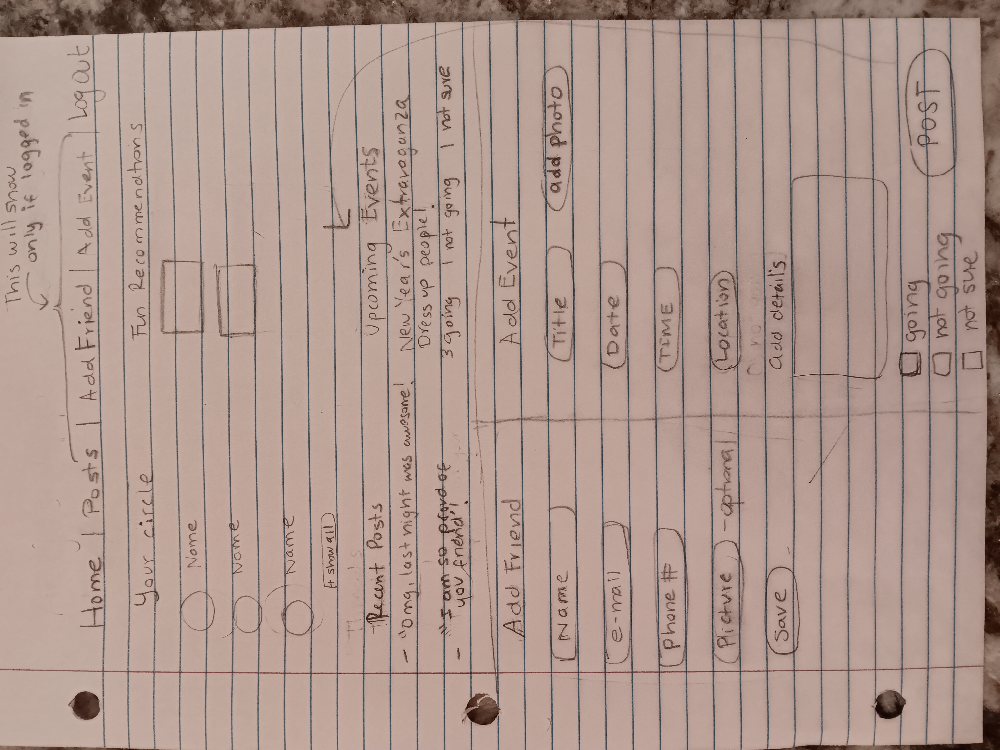
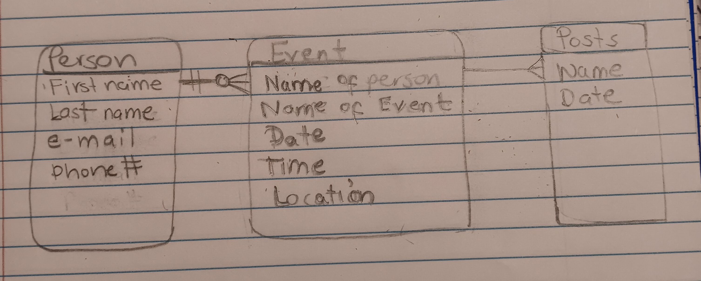

## Project 2 - Social App

This is a fun app where a group of friends can sign up for an account and have a special space for them to interact. The app displays the friends in their circle, a section with fun suggestions to do as a group, a section where friends can post events and other friends can confirm their attendance and lastly encourage each other through posts and positive notes

## User Stories

For privacy reasons, the user should only have access to the group's information if logged in. As a user I should be able to do the following:
    "*" Have a rendered view of all the friends in my circle
    "*" Have the capability of adding more friends
    "*" Post an event for the group to participate in
    "*" View a list of fun/upligting activities the friends can do in a group
    "*" Make a post about something in the group
    "*" Log out

## Wireframes

## Entry Relationship Diagram (ERD)

