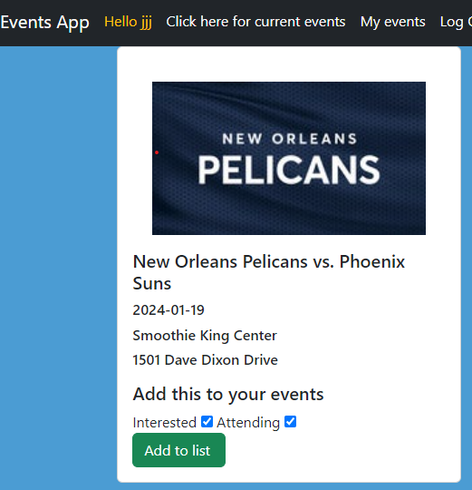
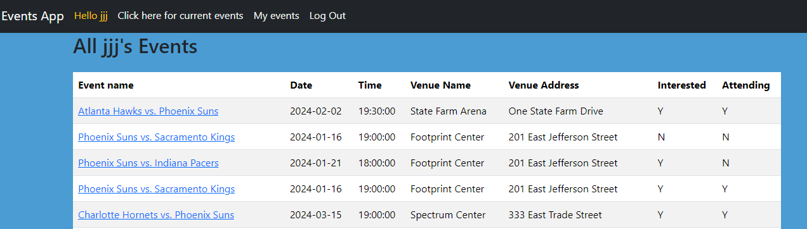
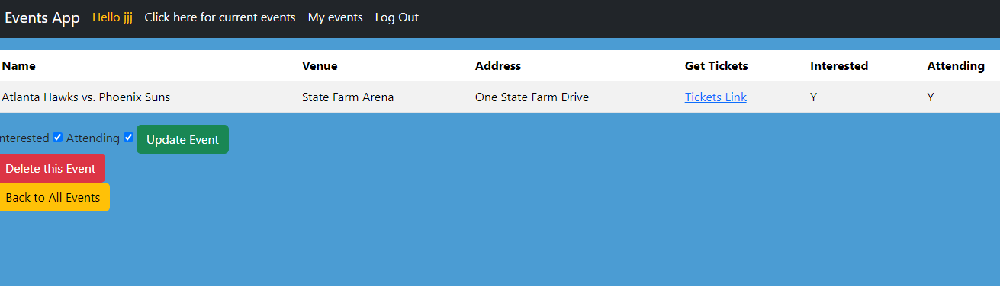

## Project 2 - Fun Events Tracker

This is a fun app where a user can track upcoming events

## User Stories

For privacy reasons, the user should only have access to the group's information if logged in. As a user I should be able to do the following:
    "*" Log in 
    "*"Have a rendered view of all the fun events coming up
    "*"Have the capability of see check boxes to choose if they are interested and/or attending
    "*Have the capability to see specific details about the event and get a link to buy tickets
    "*"Have the choice to delete events from their "my events" page 
    "*" Have the capability to update the interest or attendance options on the events
    "*" Log out

## Technologies used

Visual Code Studio
Node.js
MongoDB
Mongoose
Apple-pies-places
Stack Overflow
Geeks to Geeks

## Wireframes

## Entry Relationship Diagram (ERD)

## Future Enhancements

Capability to share events with other users through a common feed
Capability for other users to like the event and confirm if they are interested or attending
Capability to comment on any events attended 

